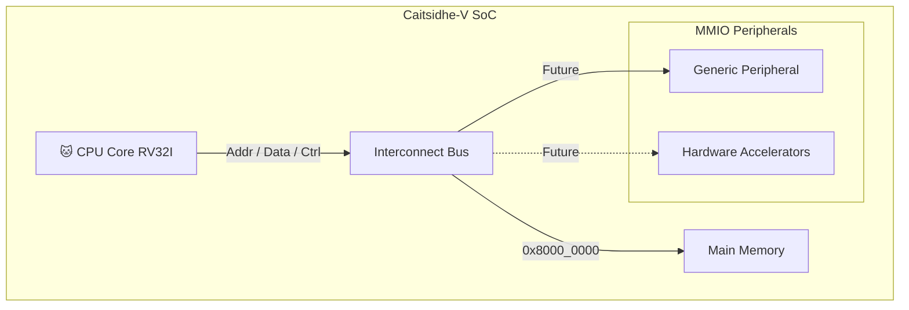

# 🐱 Caitsidhe-V SoC (Virtual Implementation)


**Caitsidhe-V** (pronounced *Cat-Sith*) is a Cycle-Accurate RISC-V System-on-Chip simulator written in C++.
Caitsidhe-V is designed to **model hardware behavior**, including a bus interconnect and MMIO. It serves as a model for future Verilog implementation and as a sandbox playground for developing hardware accelerators and peripherals.

---

## Architecture

The system is designed around the RISC-V RV32I architecture, containing a CPU Core, the interconnect bus, a main memory and peripherals.



## Features
- **Cycle-Accurate Simulation**: Models hardware timing and behavior accurately. (On progress)
- **Modular Design**: Easily extendable with new peripherals and accelerators. All components are decoupled classes, mimicking hardware modules.
- **Bus-Based Interconnect**: Centralized bus for memory and peripheral access.
- **Trace Logging**: Detailed logging for debugging and analysis.

---

## Memory Map
The Caitsidhe-V SoC uses the following memory map:
- `0x9000_0000` - `0x9FFF_FFFF`: MMIO Peripherals (Future Expansion)
- `0x8000_0000` - `0x800F_FFFF`: Main Memory (RAM), size configurable at runtime

---

## Project Structure
```
docs/
├── design/         # Design documents and architecture diagrams
├── examples/       # Example programs and usage guides
├── images/         # Images and diagrams used in documentation
├── documents/      # Additional documents related to the project
└── tutorials/      # Step-by-step tutorials for using and extending Caitsidhe-V and writing peripherals
src/
├── common/         # Type definitions (word_t, instr_t) and bit manipulation utils
├── core/           # CPU Core logic (ALU, Control Unit, Register File, Pipeline)
├── memory/         # Memory subsystem (RAM, Bus Interconnect)
├── peripherals/    # MMIO Peripherals (UART, etc.)
└── main.cpp        # System instantiation and simulation loop
tests/
├── google_tests/   # Unit tests using Google Test framework
├── matatabi/       # Set of unit tests for various components, using proprietary Matatabi framework
└── risv-arch-test/ # RISC-V architecture compliance tests
```

---

## Getting Started
Prerequisites:
- C++20 compatible compiler (e.g., GCC, Clang)
- CMake 3.30+

---

## My development roadmap:
- [x] Basic Memory (RAM) & Bus Infrastructure
- [x] Register File & ALU Implementation
- [x] CPU Core: Fetch & Decode Stages
- [ ] CPU Core: Execute & Writeback Logic
- [ ] Pipeline: Hazard Detection & Forwarding Unit
- [ ] MMIO: A bunch of peripherals
- [ ] Verification: Trace comparison with standard RISC-V simulators (Spike & riscv-arch-test)
- [ ] Docs: Documentation & Examples
- [ ] Tester and debug tools: Bus Mocker for Peripheral testing (Matatabi Mocker)

---

## License
This project is licensed under the Apache License 2.0. See the [LICENSE](LICENSE).

---

### Some notes about the project:

- Q: Why "Caitsidhe-V"?
  - Caitsidhe (Cat-Sith) is a fairy creature from Scottish and Irish mythology, how I got that far? I don't know, I just liked the name and the cat reference.
  - The "V" stands for RISC-V, the architecture being implemented. SoC = System of Cats... I mean, System-on-Chip.
- Q: Why I am doing this?
  - Honestly? I almost failed in my Computer Architecture class. So... This is my revenge!
  - Also... I have a big interest in Verilog, FPGAs and Embedded Systems. I... just can't get enough of hardware stuff.
- Q: What is the purpose of this project?
  - Caitsidhe-V is, primarily, a tool for developing peripherals and hardware accelerators in a more "hardware-like" environment.
  - It can also be used as a learning tool for understanding RISC-V architecture and SoC design.
  - And... QEMU is fantastic, but trying to add a simple custom peripheral to it is... well... 'QEMU Levels of harshness'. Caitsidhe-V is designed to be hackable and be hacked.
- Q: Is this project production-ready?
  - **No.** This project is a work in progress (WIP).. Use at your own risk.
- Q: What are the limitations of this project?
  - Currently, only the RV32I base integer instruction set will be implemented. No floating-point or advanced extensions yet.
  - The CPU core is not fully implemented; only basic components are in place.
  - Peripheral support is minimal at this stage.
- Q: Why make it "Peripheral-Centric"?
  - Most computers don't task the CPU with everything. Peripherals and hardware accelerators offload specific tasks from the CPU, improving overall system performance and efficiency.
  - This project aims to provide a platform for experimenting with such peripherals in a cycle-accurate environment without the complexity of HDLs like Verilog.
  - Plus, peripherals are fun to make!
- Q: Can I contribute?
  - Absolutely! Feel free to open issues or submit pull requests. 
  - **Rule #1:** (Optional but encouraged) YOU MUST CONTRIBUTE WITH CAT MEMES!
- Q: Which themes you use in VSCode?
  - **Catppuccin-Mocha** and **Fira Code Nerd Font**. (Because cats and fonts matter).

---

<div style='text-align: center;'>
  Build with ❤️ and 😸 by André L. Jordão!
</div>
