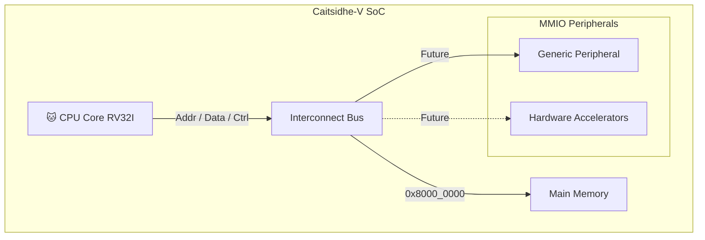

# 🐱 Caitsidhe-V SoC (Virtual Implementation)


**Caitsidhe-V** (pronounced *Cat-Sith*) is a Cycle-Accurate RISC-V System-on-Chip simulator written in C++.
Caitsidhe-V is designed to **model hardware behavior**, including a bus interconnect and MMIO. It serves as a model for future Verilog implementation and as a sandbox playground for developing hardware accelerators and peripherals.

---

## Architecture

The system is designed around the RISC-V RV32I architecture, containing a CPU Core, the interconnect bus and peripherals.



## Features
- **Cycle-Accurate Simulation**: Models hardware timing and behavior accurately. (On progress)
- **Modular Design**: Easily extendable with new peripherals and accelerators. All components are decoupled classes, mimicking hardware modules.
- **Bus-Based Interconnect**: Centralized bus for memory and peripheral access.
- **Trace Logging**: Detailed logging for debugging and analysis.

---

## Memory Map
The Caitsidhe-V SoC uses the following memory map:
- `0x9000_0000` - `0x9FFF_FFFF`: MMIO Peripherals (Future Expansion)
- `0x8000_0000` - `0x800F_FFFF`: Main Memory (RAM), size configurable at runtime

---

## Project Structure
```
src/
├── common/       # Type definitions (word_t, instr_t) and bit manipulation utils
├── core/         # CPU Core logic (ALU, Control Unit, Register File, Pipeline)
├── memory/       # Memory subsystem (RAM, Bus Interconnect)
├── peripherals/  # MMIO Peripherals (UART, etc.)
└── main.cpp      # System instantiation and simulation loop
```

---

## Getting Started
Prerequisites:
- C++20 compatible compiler (e.g., GCC, Clang)
- CMake 3.30+

Build and Run:
```bash
# Clone the repository
git clone [https://github.com/your-username/caitsidhe-v.git](https://github.com/your-username/caitsidhe-v.git)
cd caitsidhe-v

# Create build directory
mkdir build && cd build

# Configure and Build
cmake ..
make

# Run the simulator
./Caitsidhe_V
```

---

## My development roadmap:
- [x] Basic Memory (RAM) & Bus Infrastructure
- [x] Register File & ALU Implementation
- [ ] CPU Core: Fetch & Decode Stages
- [ ] CPU Core: Execute & Writeback Logic
- [ ] Pipeline: Hazard Detection & Forwarding Unit
- [ ] MMIO: A bunch of peripherals
- [ ] Verification: Trace comparison with standard RISC-V simulators (Spike)

---

## License
This project is licensed under the Apache License 2.0. See the [LICENSE](LICENSE)

---

Developed with 🐱 and ❤️ by [André L. Jordão](https://github.com/AndreLimaJordao) - UFPE/CIn

---

### Some notes about the project (FAQ & Motivation):

- Why "Caitsidhe-V"?
  - Caitsidhe (Cat-Sith) is a fairy creature from Scottish and Irish mythology, how I got that far? I don't know, I just liked the name and the cat reference.
  - The "V" stands for RISC-V, the architecture being implemented. SoC = System made by good O'Cats.
- Why I am doing this?
  - Because I had nothing better to do and somehow I almost failed in my Computer Architecture class.
  - Also... I have a big interest in Verilog, FPGAs and Embedded Systems. I... just can't get enough of hardware stuff.
- What is the purpose of this project?
  - Did you try making your own peripheral in QEMU? Me neither... but I know it is bad...
  - Also... Caithsidhe-V is, primarily, a tool for developing peripherals and hardware accelerators in a more "hardware-like" environment.
  - It can also be used as a learning tool for understanding RISC-V architecture and SoC design.
- Is this project production-ready?
  - No, this is a learning project and a prototype. Use it at your own risk.
- Can I contribute?
  - Absolutely! Feel free to open issues or submit pull requests. (YOU MUST CONTRIBUTE WITH CAT MEMES)!
- Which themes you use in VSCode?
  - Catppuccin-Mocha and Fira Code Nerd Font. (Because cats and fonts matter).